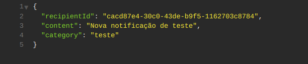
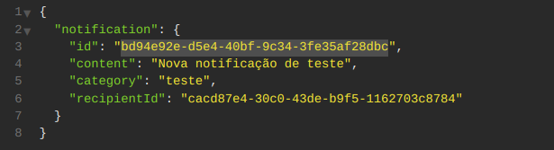
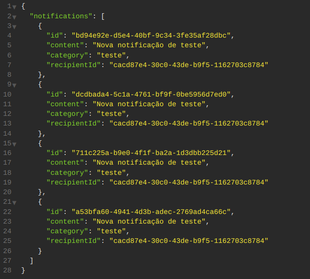

  <a href="#-tecnologias">Tecnologias</a>&nbsp;&nbsp;&nbsp;|&nbsp;&nbsp;&nbsp;
  <a href="#-projeto">Projeto</a>&nbsp;&nbsp;&nbsp;|&nbsp;&nbsp;&nbsp;
  <a href="#-como-rodar">Como rodar</a>&nbsp;&nbsp;&nbsp;|&nbsp;&nbsp;&nbsp;
  <a href="#-como-contribuir">Como contribuir</a>&nbsp;&nbsp;&nbsp;
  

 

## 🚀 Tecnologias

Esse projeto foi desenvolvido com as seguintes tecnologias:

- [Nodejs](https://nodejs.org/en/) - v18.12.1 
- [Nestjs](https://nestjs.com/) - 9.1.5
- [Npm](https://www.npmjs.com/) - 8.19.2

## 💻 Projeto

Projeto desenvolvido com Node.js de uma API de notificações.

Evento do Ignite Lab na plataforma da [Rocketseat](https://www.rocketseat.com.br/).

## 🚀 Como Rodar

- Clone o projeto.
- Entre na pasta do projeto e rode 'npm install' (use 'yarn install' se for essa a sua configuração).
- npx prisma migrate dev.
- npx prisma studio (para visualizar a página do banco de dados).
- npm run start:dev (roda o projeto na porta localhost:3000).
- npm run test (para rodar os testes).

## 👩🏿‍💻 Rotas

- **`POST /notifications`**: Rota para criação de notificações:

Envia:

  

Retorna:

  

- **`GET /notifications/from/:recipientId`**: Rota para mostrar as notificações de um mesmo usuário:

Retorna:

  

- **`GET /notifications/count/from/:recipientId`**: Rota para mostrar a contagem de notificações de um mesmo usuário:

Retorna:

  

- **`PATCH /notifications/:id/cancel`**: Rota para cancelar notificações.
- **`PATCH /notifications/:id/read`**: Rota para mostrar uma notificação como lida.
- **`PATCH /notifications/:id/unread`**: Rota para mostrar uma notificação como não lida.

## 🤔 Como contribuir

- Faça um fork desse repositório;
- Cria uma branch com a sua feature: `git checkout -b minha-feature`;
- Faça commit das suas alterações: `git commit -m 'feat: Minha nova feature'`;
- Faça push para a sua branch: `git push origin minha-feature`.

Depois que o merge da sua pull request for feito, você pode deletar a sua branch.

## 📝 Licença

Esse projeto está sob a licença MIT.
